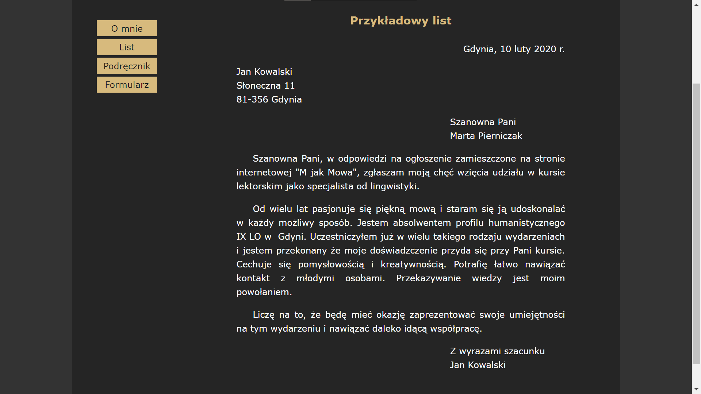
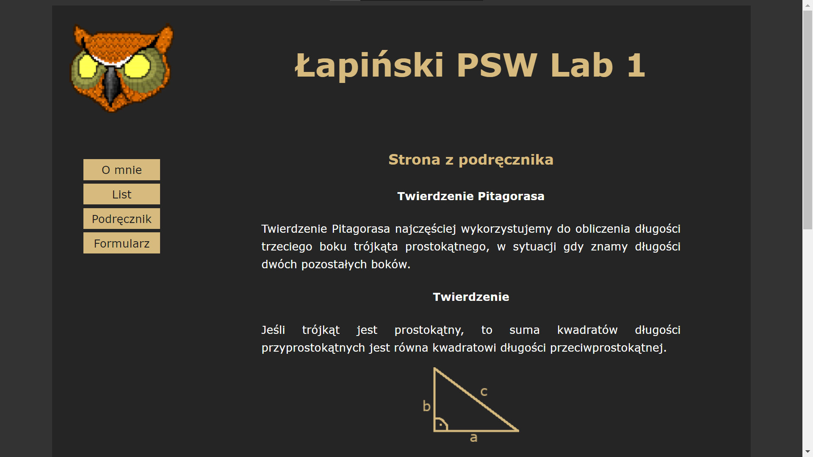

# 1. Praca z systemem kontroli wersji. Podstawy WWW.
## Cel
- stworzyć prostą stronę WWW, nie wymagającą użycia serwera webowego
- strona powinna zawierać linki do trzech podstron, które należy utworzyć:
  - strona z listem (odpowiednio sformatowany tekst, przypominający list)
  - strona z podręcznika, np. do informatyki (rysunki, tabele, wzory itp.)
  - strona z formularzem (inputy, pola tekstowe, checkboxy itp.), na początku bez walidacji wartości pól
  - na stronie startowej należy umieścić informację o autorze oraz opcjonalnie np. logo, informacje o użytych technologiach itp
  
## Efekty pracy
 
 Strona główna zawierająca krótki tekst powitalny.
 Po lewej stronie znajduje się pasek nawigacyjny do pozostałych podstron.\
 
 Przykładowy list z zastosowanym formatowaniem tekstu.
 Na zrzucie nie widać nagłówka, ale jest on identyczny jak w pozostałych podstronach.\
 Został obcięty ponieważ strona jest na tyle mała że nie było sensu dzielić zrzutów na dwoje.\
  
 
 Krótka strona przedstawiająca niektóre własności trójkąta prostokątnego.\
 Do wykonania składni matematycznej wykorzystałem bibliotekę Mathjax.\
 
 Ostatnia podstrona zawierająca prosty formularz zgłoszeniowy.

**Komentarz:**
Stronę wykonałem od podstaw samemu. Nie chciałem korzystać na razie z żadnego szablonu żeby dobrze zrozumieć podstawy HTML i CSS.
