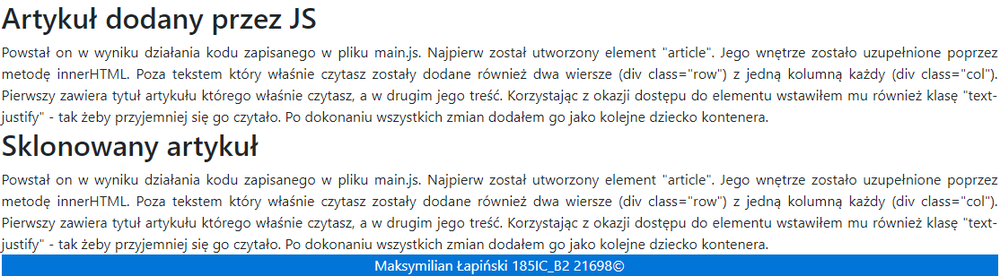

# 2. Praca z elementami DOM + ćwiczenia
## Cel
- wykorzystać Java Script (vanilla, jQuery lub inny) do wyświeltlania, modyfikowania, tworzenia (itp. itd.) elementów strony związanych z HTML i CSS
- należy użyć wybrany (dowolny) framework front-endowy
- użyć w wybranych przez siebie fragmentach kodu “trybu ścisłego” - use strict
  
## Efekty pracy
 
 Tak prezentuje się strona przed modyfikacjami dokonanymi za pomocą JavaScript.
 Do stylizowania strony wykorzystałem framework - bootstrap.\
 Na stronie znajduje się jedynie nagłówek i dwa artykuły.\
 Jeden z przykładowym tekstem i drugi z pojedynczym obrazkiem.\
 
 W pierwszej części zmodyfikowanej wersji strony, poza zmianami w stylizacji wprowadziłem prostą animowaną galerię.\
 
 Na drugiej części widać same nowe elementy. Przy pomocy JS'a dodałem zupełnie nowe dwa artykuły oraz stopkę.

**Komentarz:**
Do realizacji zadania starałem się wykorzystać jak najwięcej metod i wszelakich sposobów tworzenia, modyfikacji i usuwania elementów strony.\
Wiem że większość z tych rozwiązań jest bez sensu w praktycznym zastosowaniu, jednak na potrzeby laboratorium starałem się po prostu przetestować jak najwięcej funkcjonalności.