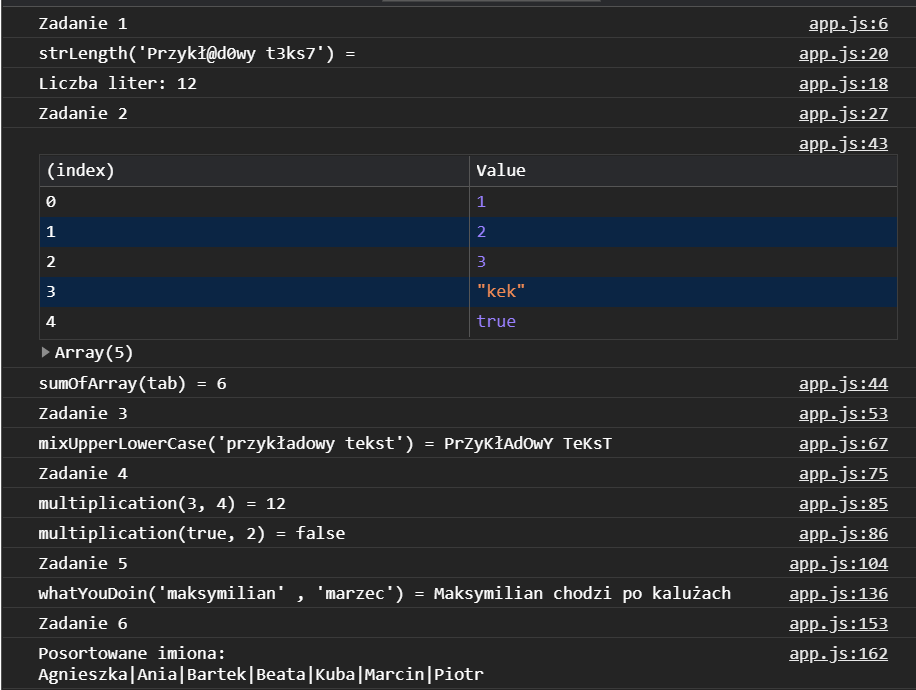
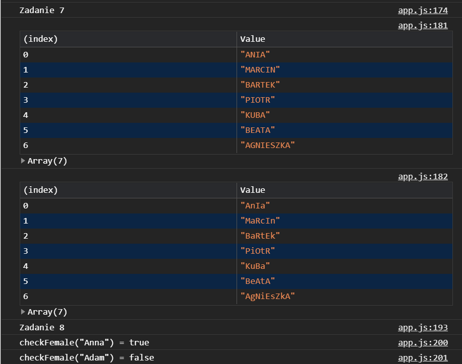
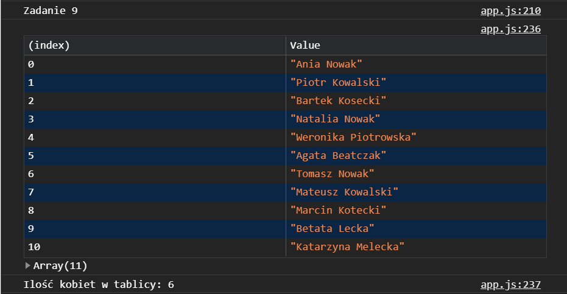
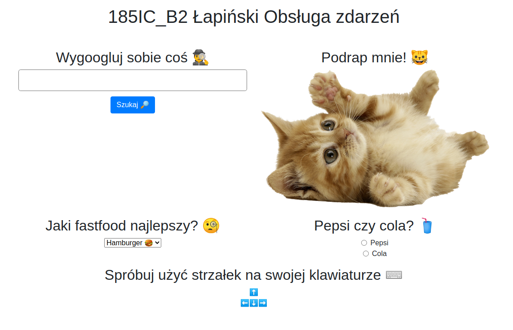
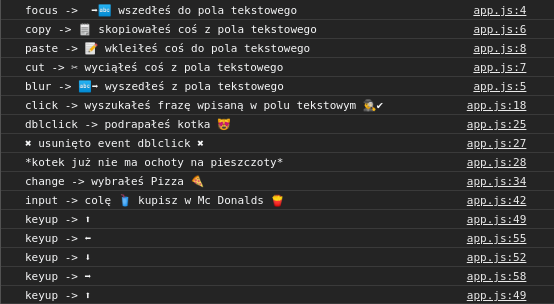
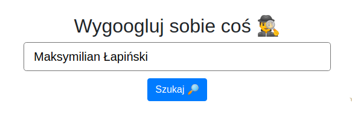
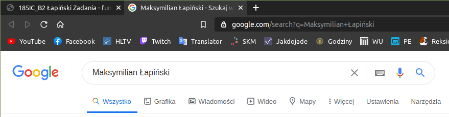

# 3. Obsługa zdarzeń
## Cel
1. wykonać [zadania z JavaScript - część 1](https://github.com/kartofelek007/zadania-podstawy/tree/master/3-funkcje/1-zadania)
2. za pomocą metody addEventListener należy obsłużyć 10 różnych wybranych zdarzeń

## Efekty pracy

### Ad 1.
Poniżej pzedstawione są efekty działania kodu [app.js](Zadania/scripts/app.js)

Zadania 1-6\
\
Zadania 7-8\
\
Zadanie 9\

### Ad 2.
Tak prezentuje się strona\
\
Tak prezentuje się wynik interakcji z nią\
\
\
