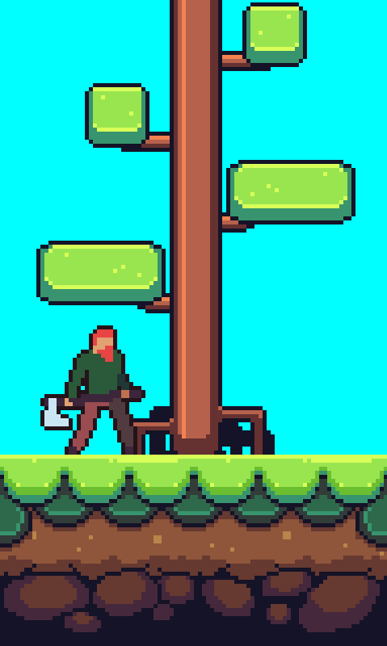
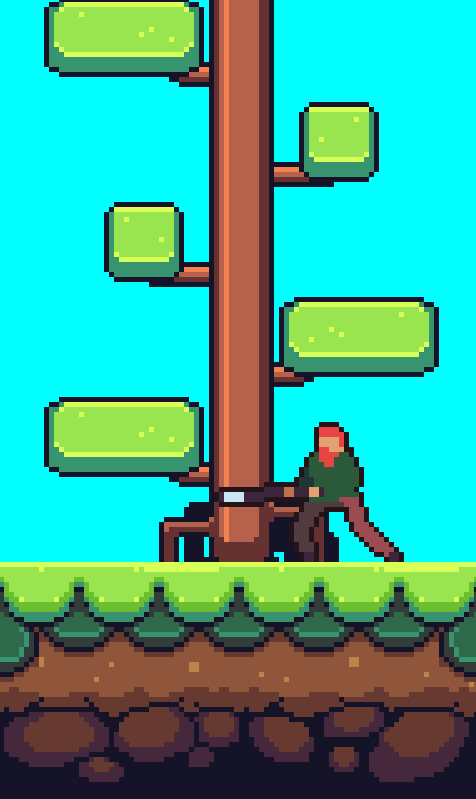
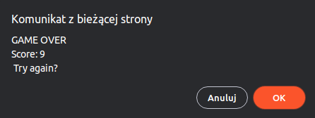

# 4. Gra przeglądarkowa
## Cel
- zrealizować grę przeglądarkową- inną niż była na zajęciach
- należy wykorzystać element do implementowania podstawowych mechanik gry jak renderowanie, przesuwanie grafik, wykrywanie kolizji, mechanizmu sterowania oraz stanu wygrania/przegrania
- nie należy korzystać z silników gier, dopuszczalna prosta biblioteka JS, np. jQuery
- wskazany dokładny opis tego, co robi dana funkcja lub wybrany fragment kodu
- wskazane użycie event listenerów, obsługa klawiszy i/lub myszki, itp.
  
## Efekty pracy
Gra wygląda następująco. Wcielamy się w silnego drwala którego zadaniem jest ścięcie magicznego drzewa.\
\
Magicznego drzewa nie da się ściąć od razu, trzeba je ścinać kawałek po kawałku. Po każdym potężnym uderzeniu naszego drwala odpada kawałek pnia, a pozostała część drzewa spada na dół i ponownie łączy się z korzeniem.\
\
Naszym zadaniem jest zciąć jak największą ilość magicznego drzewa bez uszczerbku na zdrowiu. Należy uważać żeby gałąź nie spadła nam na głowę, bo gdy tak się stanie nasza postać traci przytomność i cały proces zcinania trzeba będzie zacząć od nowa.\

### Sterowanie
**<--** - ścięcie drzewa z lewej strony
**-->** - ścięcie drzewa z prawej strony
