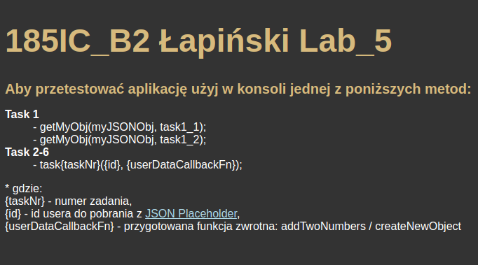
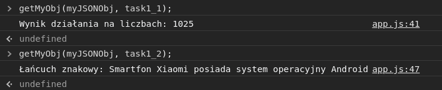
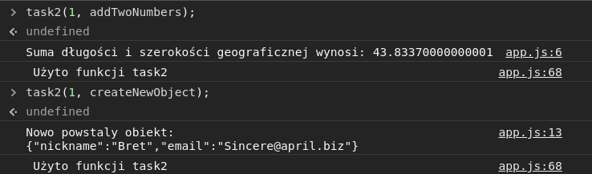
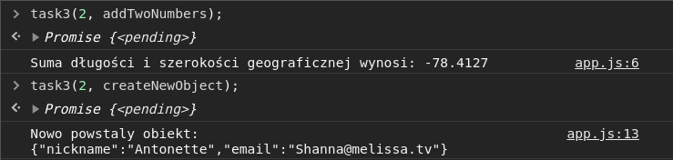
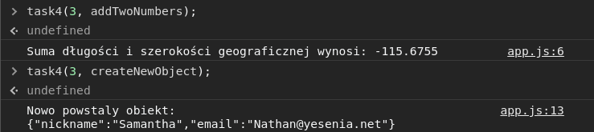
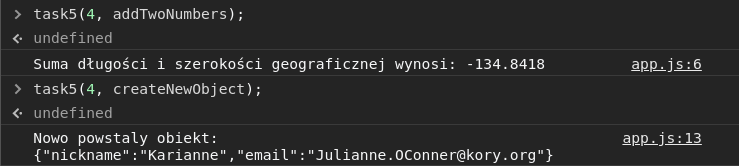
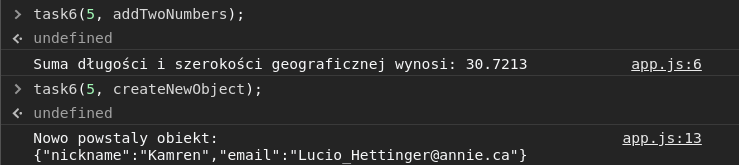

# 5. Asynchroniczny Java Script
## Cel
**1. funkcja zwrotna (callback)**
- utwórzyć obiekt JSON, zawierający w środku co najmniej podwójnie zagnieżdżone obiekty JSON
-  ww. obiekty powinny zawierać w tablicach i wartościach obiektów liczby i łańcuch znakowe
-  task1: wykorzystać funkcję zwrotną do pobrania dwóch różnych wartości liczbowych (z różnych poziomów zagnieżdżenia) z ww. obiektu JSON i wykonać wybrane działanie na tych liczbach
-  task 2: wykorzystać funkcję zwrotną do pobrania dwóch różnych łańcuchów znakowych (z różnych poziomów zagnieżdżenia) z ww. obiektu JSON i za pomocą template strings stwórzyć łańcuch znakowy z użyciem obu wcześniej wyekstrahowanych łańcuchów znakowych

**2. obiekt Promise (resolve, reject) z metodami then(), catch() i finally()**
- task 1: wykorzystać obiekt Promise do pobrania dwóch różnych zasobów liczbowych i napisać funkcję wykonującą wybrane działanie na tych liczbach
- task 2: wykorzystać obiekt Promise do pobrania dwóch różnych dowolnych zasobów i napisać funkcję tworzącą z nich nowy obiekt
- obsłużyć wszystkie pięć metod obiektu Promise
- do pobierania zasobów wykorzystać metodę fetch lub bibliotekę axios

**3. async/await + fetch (lub axios)**
- task 1: jak w pkt. 2
- task 2: jak w pkt. 2
- stworzyć funkcje wykorzystujące składnię async/await
- do pobierania zasobów wykorzystać metodę fetch lub bibliotekę axios.

**4. Zapytania AJAX**
- task 1: jak w pkt. 2
- task 2: jak w pkt. 2
- obsłużyć sukces zapytania (właściwość ‘onload’ obiektu XHR)
- obsłużyć błąd zapytania (właściwość ‘onerror’ obiektu XHR)

**5. Metoda fetch**

- task 1: jak w pkt. 2
- task 2: jak w pkt. 2
- nie używamy async/await

**6. Biblioteka axios**
- task 1: jak w pkt. 2 i 3
- task 2: jak w pkt. 2 i 3
- nie używamy async/await

## Efekty pracy
**Wygląd strony**\
\
**Ad. 1**\
Funkcja getMyObj stosuje metodę callback na objekcie podanym jako pierwszy parametr funkcji.\
\
**WAŻNE!**\
W każdej funkcji task(2-6), funkcja oczekuje id usera do pobrania z [JSON Placeholder](https://jsonplaceholder.typicode.com/users), oraz funkcji callback która zostanie wywołana na pobranym obiekcie.\
Utworzyłem dwie funkcje (addTwoNumbers i createNewObject), które będą dalej stosowane jako funkcje callback. Pobierają one dwa wybrane wartości z obiektów userData i wykonują na nich odpowiednie operacje (których efekt jest wyświetlany za pomocą console.log()).\
**Ad. 2**\
\
**Ad. 3**\
\
**Ad. 4**\
\
**Ad. 5**\
\
**Ad. 6**\
