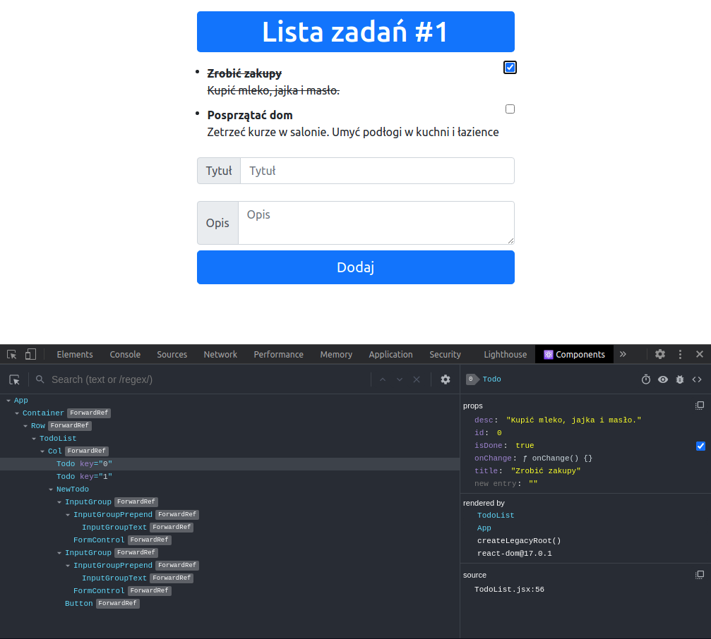

# 6. React - aplikacja nr 1
## Cel
W aplikacji należy zrealizować nw. zadania:
- tworzenie aplikacji za pomocą modułu ‘create-react-app’,
- tworzenie komponentów funkcyjnych i klasowych,
- należy utworzyć komponent nadrzędny i dwa komponenty potomne, mogą to być np. tabele, listy ‘ol’ lub ‘ul’, obrazki itp. Dowolność wyboru, aby nie były to przykłady zbyt zbliżone do tych z repo,
- należy wykorzystać props (atrybuty, właściwosci) przy przekazywaniu danych do komponentu potomnego,
- należy wykorzystać state (stan) przy tworzeniu komponentu klasowego,
- należy dodać plik .css do wybranych komponentów,
- należy zastosować funkcję map() przy generowaniu komponentów i należy pamiętać o atrybucie key,
- należy zrealizowac wysyłanie funkcji za pomocą ‘props’.
  
## Efekty pracy
Aplikacja składa się z 3 głównych elementów:
- tytułu,
- listy zadań (komponent klasowy),
- formularza tworzącego nowe zadanie (komponent funkcyjny).

"TodoList" przechowuje w swoim stanie listę obiektów na których podstawie powstają komponenty "Todo" (reprezentujące pojedyncze zadanie) - wyświetlane jaki elementy listy nienumerowanej.\
\
Obok każdego zadania znajduje się checkbox. Przyciśnięcie go oznacza że dane zadanie zostało wykonane. Po przyciśnięciu treść zadania zostaje przekreślone, ponieważ zmienia się stan komponentu (isDone: true)\
\
Formularz posiada dwa pola do wypełnienia. Tytuł i opis nowego zadania. Po przyciśnięciu przycisku "Dodaj", zostaje dodany do listy zadań nowy komponent Todo. Jest on utworzony na podstawie obiektu "newTodo", który znajduje się w stanie "TodoList".

Dodatkowo, w aplikacji wykorzystałem komponenty z React Bootstrap.