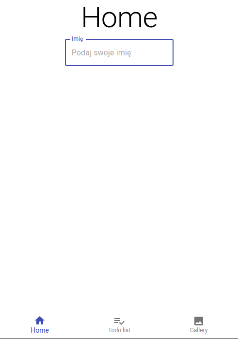
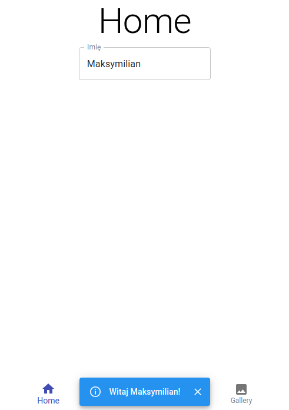
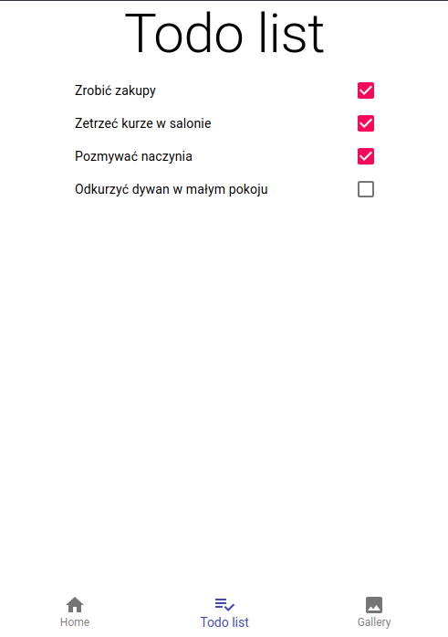
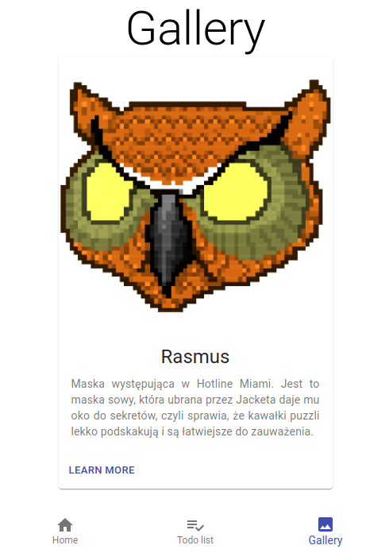

# 7. React - aplikacja nr 2
## Cel
Wykorzystać Material-UI i React-Router do utworzenia prostej SPA:
- należy stworzyć trzy “podstrony” (komponenty link, Switch i Route),
- na każdej z ww. podstron powinny znaleźć się trzy różne komponenty z Material UI
  
## Efekty pracy
Aplikacja składa się z 3 "podstron":
- Home (/),
- TodoList (/todolist),
- Gallery (/gallery),

między którymi można poruszać się za pomocą paska nawigacyjnego ([BottomNavigation](https://material-ui.com/components/bottom-navigation/#bottom-navigation)) umieszczonego na dolnej części strony.
Do przemieszczania się pomiędzy "podstronami" wykorzystałem react-router.
Na "szczycie" każdej strony zostaje wyświetlony tytuł informujący gdzie aktualnie się zanjdujemy ([Typography](https://material-ui.com/components/typography/#typography)).\

### Home
Home zawiera proste pole tekstowe ([TextField](https://material-ui.com/components/text-fields/#text-field)) które "prosi" o imię użytkownika.
Komponent ten został podpięty do [ClickAwayListener](https://material-ui.com/components/click-away-listener/#click-away-listener), dzięki czemu po wyjściu z pola tekstowego na stronie zostanie wyświetlony komunikat ([Snackbar](https://material-ui.com/components/snackbars/#snackbar)). Ponowny komunikat zostanie wyświetlony ponownie dopiero po zmianie wartości pola tekstowego.\

### TodoList
Todolist zawiera liste zadań do wykonania ([List](https://material-ui.com/components/lists/#lists)). Każde zadanie można oznaczyć jako wykonane poprzez zaznaczenie checkboxa. \

### Gallery
W galerii umieściłem kartę ([Card](https://material-ui.com/components/cards/#card)) zawierającą zdjęcie razem z krótkim jego podpisem i przycisk przekierowujący do zewnętrznej strony.\

Dodatkowo korzystałem jeszcze z takich komponentów jak [Container](https://material-ui.com/components/container/#container), [Box](https://material-ui.com/components/box/#box), [Icons](https://material-ui.com/components/material-icons/).