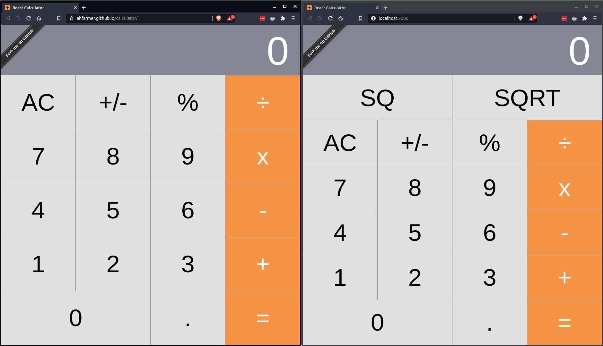
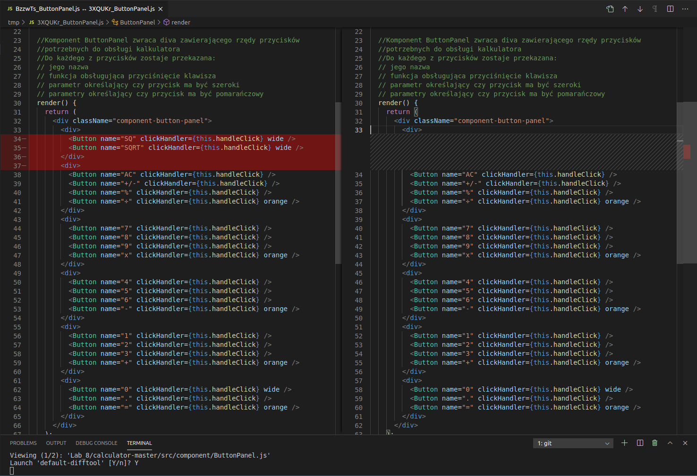
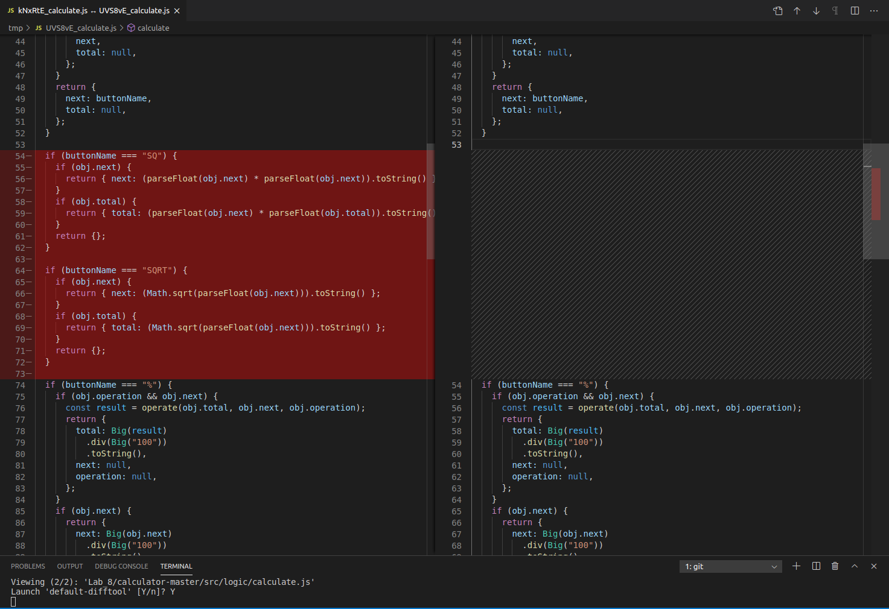

# 8. React - aplikacja nr 2 + analiza kodu źródłowego + git difftool
## Cel
- należy wybrać przykład, przeanalizować go i dokonać swoich modyfikacji,
- należy dokładnie opisać (skomentować) kod aplikacji (zainstalowane moduły, użyte komponenty itp.) oraz wprowadzone własne modyfikacje,
- ww. modyfikacje kodu należy zaprezentować wizualnie na zrzucie ekranu po komendzie git difftool

## Efekty pracy
Jako przykład do analizy wybrałem [Calculator](https://github.com/ahfarmer/calculator). Po wcześniejszej analizie kodu, okrasiłem go komentarzami i dokonałem własne modyfikacje w dwóch plikach: [ButtonPanel](calculator-master/src/component/ButtonPanel.js).js i [calculate.js](calculator-master/src/logic/calculate.js).

Poniżej przedstawiam wygląd aplikacji przed i po modyfikacjach.\

Jak widać dodałem dwa nowe przyciski:
- SQ - funkcja podnosząca wpisaną liczbę do kwadratu
- SQRT - funkcja wykonująca operację pierwiastka kwadratowego na wpisanej liczbie.

### Git difftool
Tak prezentują się zmiany kodzie:\
\

