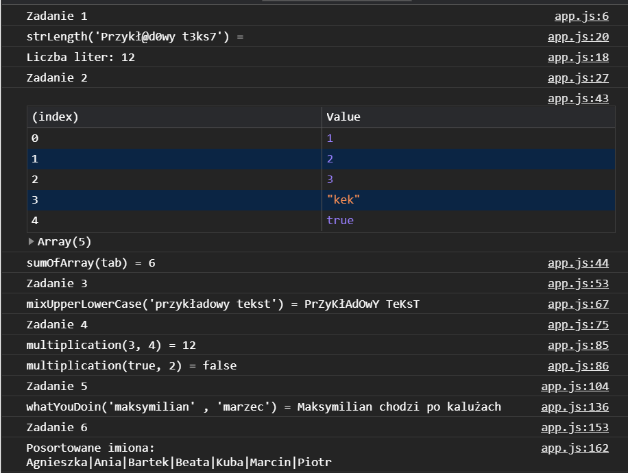
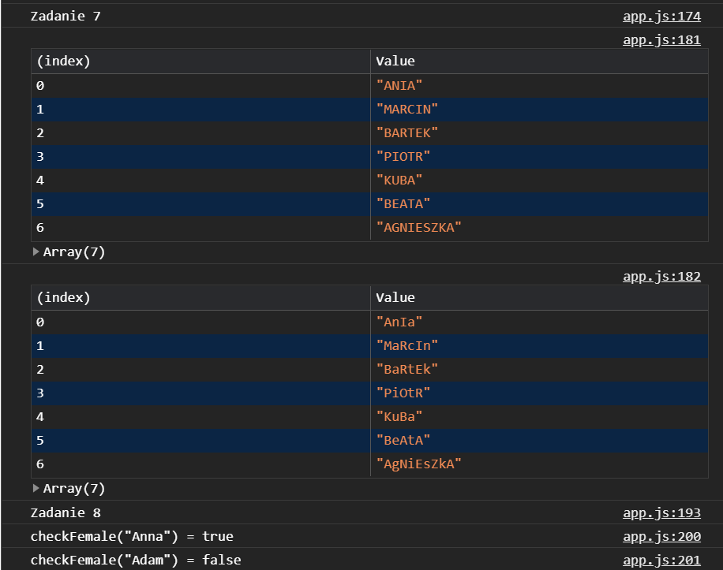

# projektowanie-serwisow-www-Lapinski-185ic
Repozytorium przeznaczone do przechowywania zadań realizowanych na potrzeby PSW.
## Lab 1
**Cel:**
- stworzyć prostą stronę WWW, nie wymagającą użycia serwera webowego
- strona powinna zawierać linki do trzech podstron, które należy utworzyć:
  - strona z listem (odpowiednio sformatowany tekst, przypominający list)
  - strona z podręcznika, np. do informatyki (rysunki, tabele, wzory itp.)
  - strona z formularzem (inputy, pola tekstowe, checkboxy itp.), na początku bez walidacji wartości pól
  - na stronie startowej należy umieścić informację o autorze oraz opcjonalnie np. logo, informacje o użytych technologiach itp
  
  **Efekty pracy:**
 
 Strona główna zawierająca krótki tekst powitalny.
 Po lewej stronie znajduje się pasek nawigacyjny do pozostałych podstron.
 
 Przykładowy list z zastosowanym formatowaniem tekstu.
 Na zrzucie nie widać nagłówka, ale jest on identyczny jak w pozostałych podstronach.
 Został obcięty ponieważ strona jest na tyle mała że nie było sensu dzielić zrzutów na dwoje.
  
 
 Krótka strona przedstawiająca niektóre własności trójkąta prostokątnego.
 Do wykonania składni matematycznej wykorzystałem bibliotekę Mathjax.
 
 Ostatnia podstrona zawierająca prosty formularz zgłoszeniowy.

**Komentarz:**
Stronę wykonałem od podstaw samemu. Nie chciałem korzystać na razie z żadnego szablonu żeby dobrze zrozumieć podstawy HTML i CSS.

## Lab 2
**Cel:**
- wykorzystać Java Script (vanilla, jQuery lub inny) do wyświeltlania, modyfikowania, tworzenia (itp. itd.) elementów strony związanych z HTML i CSS
- należy użyć wybrany (dowolny) framework front-endowy
- użyć w wybranych przez siebie fragmentach kodu “trybu ścisłego” - use strict
  
  **Efekty pracy:**
 
 Tak prezentuje się strona przed modyfikacjami dokonanymi za pomocą JavaScript.
 Do stylizowania strony wykorzystałem framework - bootstrap.
 Na stronie znajduje się jedynie nagłówek i dwa artykuły. 
 Jeden z przykładowym tekstem i drugi z pojedynczym obrazkiem.
 
 W pierwszej części zmodyfikowanej wersji strony, poza zmianami w stylizacji wprowadziłem prostą animowaną galerię.
 
 Na drugiej części widać same nowe elementy. Przy pomocy JS'a dodałem zupełnie nowe dwa artykuły oraz stopkę.

**Komentarz:**
Do realizacji zadania starałem się wykorzystać jak najwięcej metod i wszelakich sposobów tworzenia, modyfikacji i usuwania elementów strony.
Wiem że większość z tych rozwiązań jest bez sensu w praktycznym zastosowaniu, jednak na potrzeby laboratorium starałem się po prostu przetestować jak najwięcej funkcjonalności.

## Lab 3
**Cel:**
1. wykonać [zadania z JavaScript - część 1](https://github.com/kartofelek007/zadania-podstawy/tree/master/3-funkcje/1-zadania)
2. za pomocą metody addEventListener należy obsłużyć 10 różnych wybranych zdarzeń

**Ad 1.**
Poniżej pzedstawione są efekty działania kodu [app.js](Lab_3/Zadania/scripts/app.js)

Zadania 1-6

Zadania 7-8

Zadanie 9

**Ad 2.**
